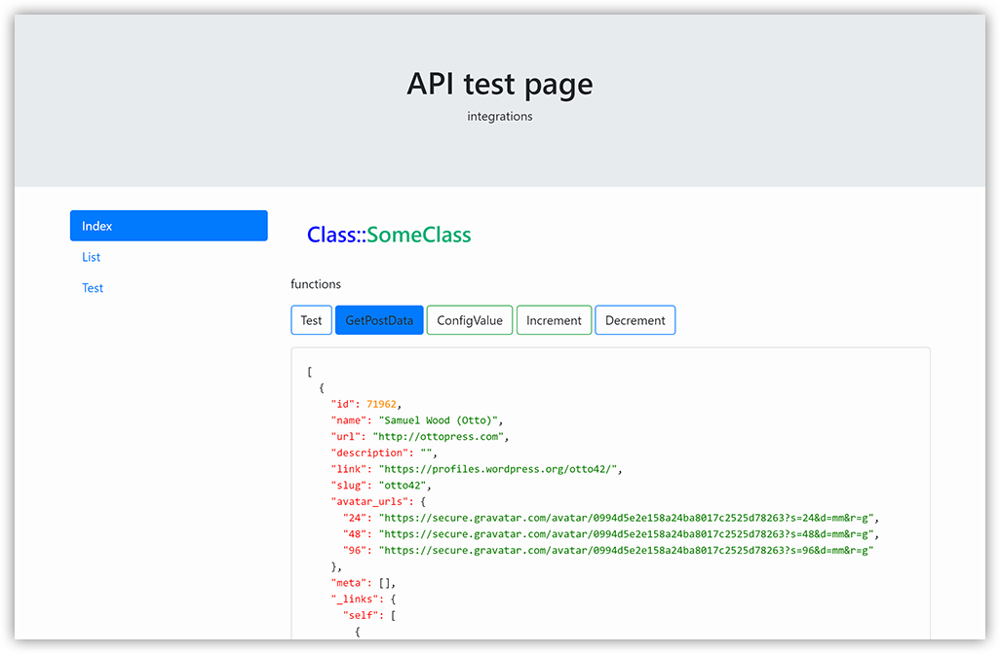

# Template for DEV and testing Some class

template for php developers



## feature
- Bootstrap front
- less 
- routes
- save setting on file class
- GET/POST request
- highlight json
- php highlighted dumo **__dump($var)**;

```php
$host = 'http://localhost:1880/';
$login = 'login';
$pass = 'pass';
$instance = new SomeClass($host, $login, $pass);


if($action == lower('GetPostData')){
    $data = $instance->GetPostData();
    ResponseJson($data);
}
else if($action == lower('Test')){
    $data = $instance->Test();
    ResponseJson($data);
}
else if($action == lower('ConfigValue')){
    $data = $instance->ConfigValue();
    ResponseJson($data);
}
else if($action == lower('Increment')){
    $data = $instance->Increment();
    ResponseJson($data);
}
else if($action == lower('Decrement')){
    $data = $instance->Decrement();
    ResponseJson($data);
}
else {
    http_response_code(501);
    ResponseJson([
        'Error' => 'Action not found'
    ]);
}
```